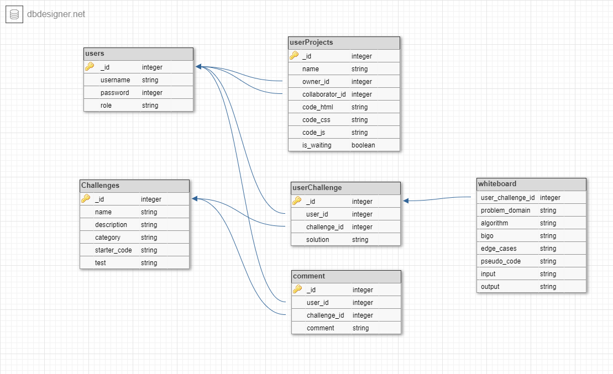

# Coodak

## it's an application that  you can signin / signup  to allow you to start bulding a web site using **HTML** **CSS** **JAVASCRIPT**  throgh an online code editor that provide you the result of your code , also you can work with your partner in the same challenge to adjust the same file with real time connection

## Group Name

- Laith Al Daree
- Raghad Anees
- Adnan Muammar
- Mohammad Samara

## users Stories

1- As a User i want to be able to write my code on the page and get the result
2- As a User i want to be able to signup/signin ,  So that i can save my projects in my profile
3- As a User i want to see a simple implementation UI/UX
4- As a User i want to be able to work with my partner on the same challenge at the same time
5- A a User i wante to solve some challenges to test my abilitys
6- An admin can create and delete user accounts

## Date

```javascript
---
date: 2020-10-1 10:00
---
```

## Schemas



## Wire Frame

[https://wireframe.cc/pro/pp/fa4c8b89c378873](https://wireframe.cc/pro/pp/fa4c8b89c378873)

## live url

[heroku-live](coodak.herokuapp.com/)
